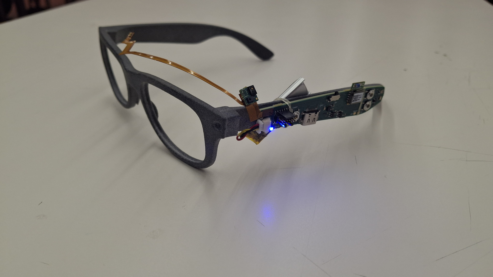
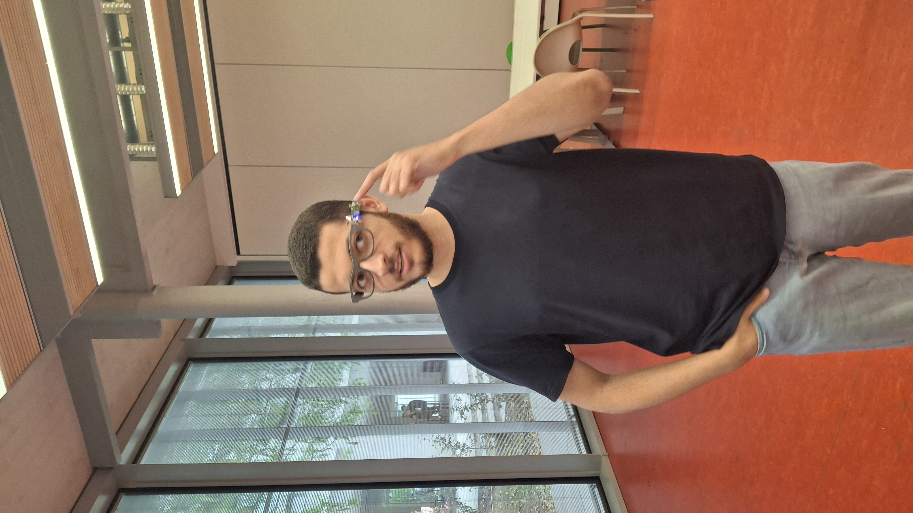
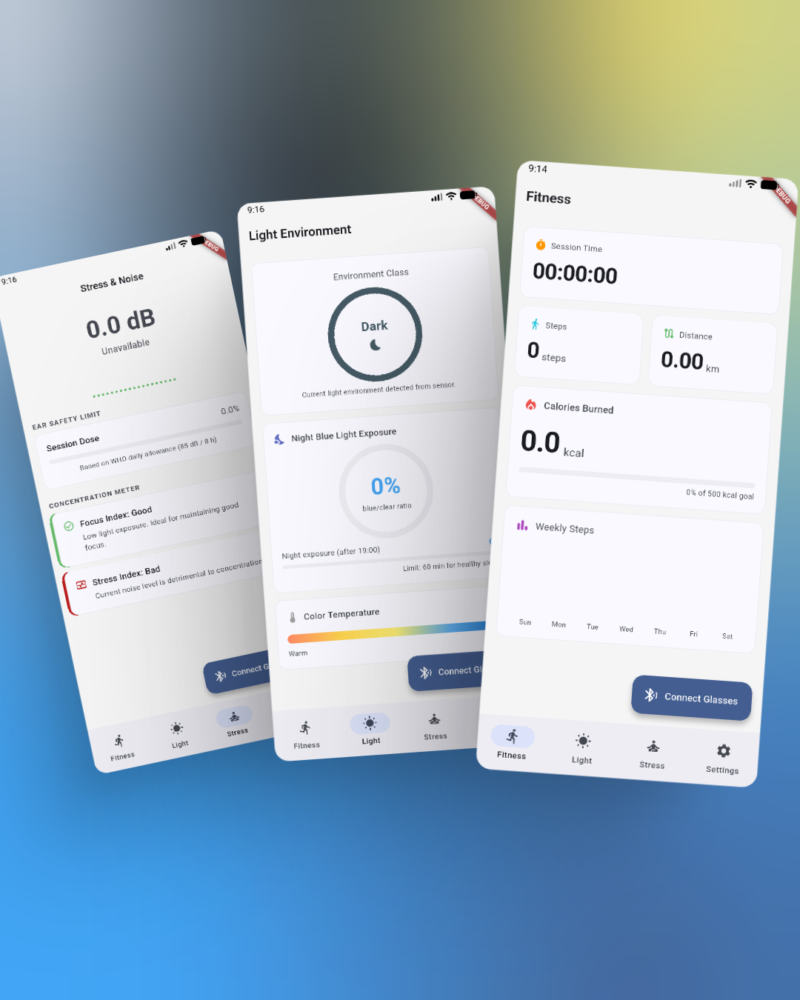
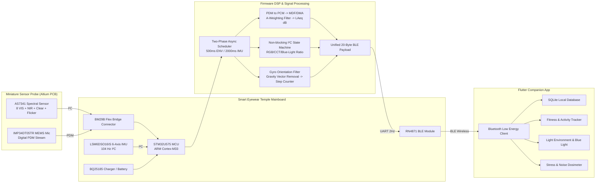
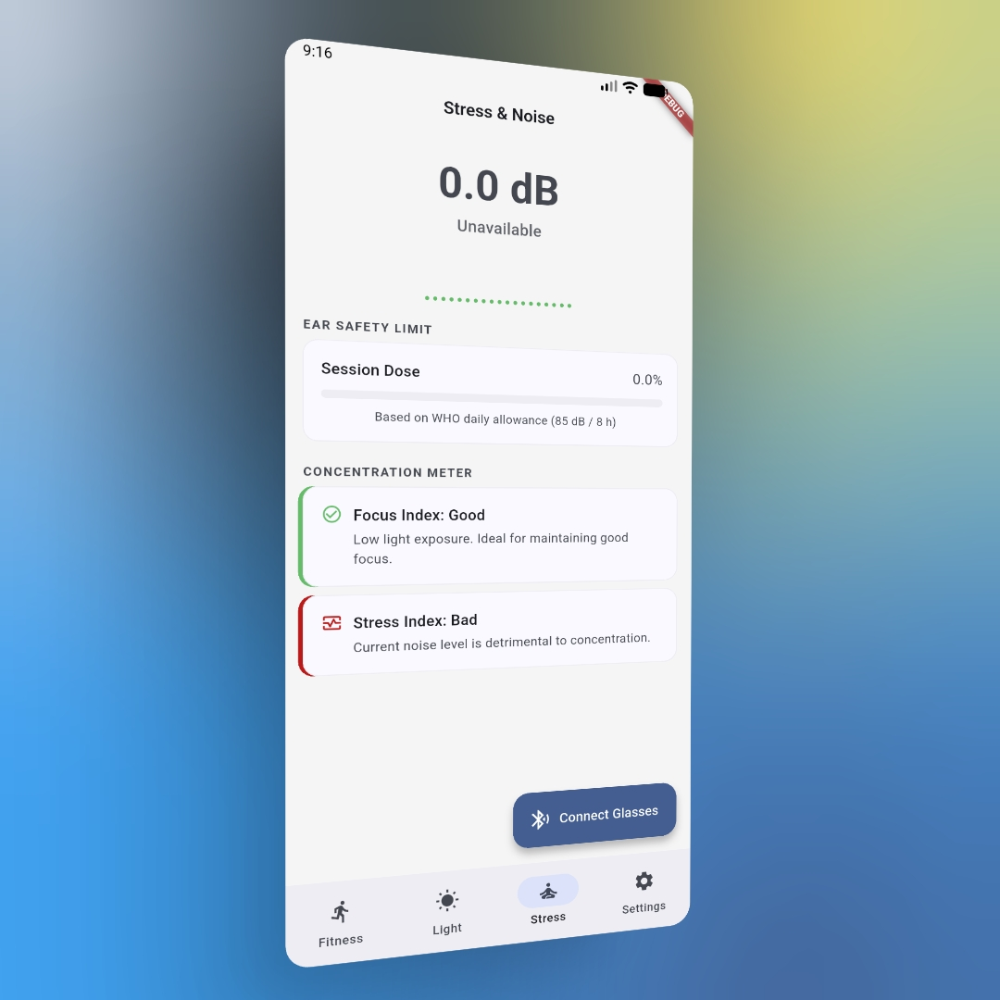
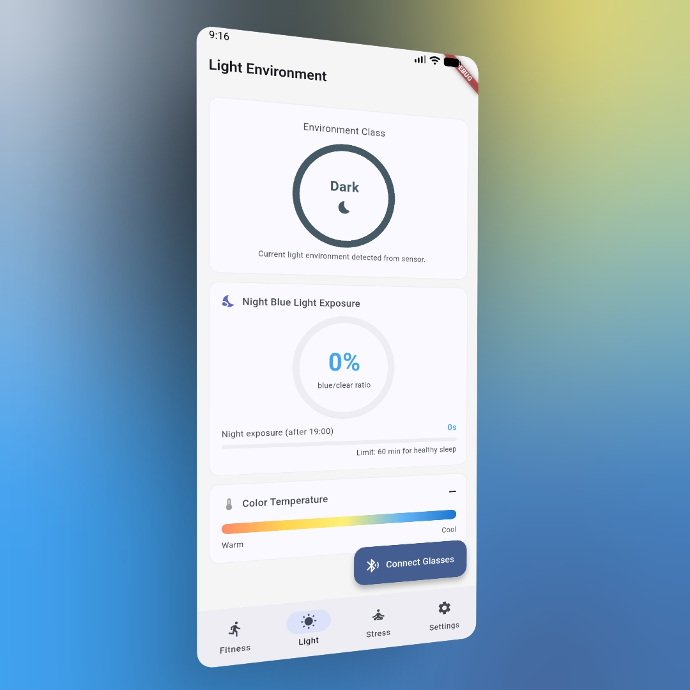
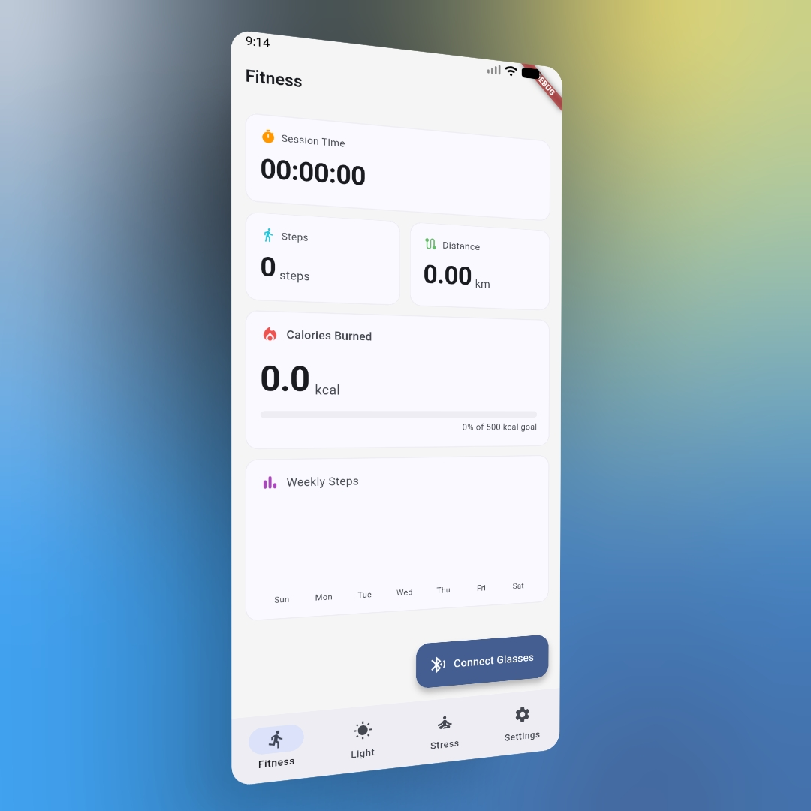

# Lumos: Smart Eyewear for Cognitive Well-Being & Environmental Monitoring

[](https://www.deib.polimi.it/)
[](https://www.st.com/)
[](https://flutter.dev/)
[](https://www.altium.com/)
[](https://www.mathworks.com/)
[](#)
[](https://youtu.be/2R6SbuI6aNU)

> **Lumos** is an intelligent, low-power smart eyewear system engineered to track environmental parameters (ambient sound levels, optical spectral composition, color temperature, blue-light exposure) and user physical activity (step counting with gravity compensation) in real time. Lumos translates raw sensory streams into actionable cognitive focus and stress insights displayed through a cross-platform companion mobile app.

---

## 📺 Video Demonstration

[](https://youtu.be/2R6SbuI6aNU?is=nBhr0ABMkU_S1Qfo)

*Check out the full end-to-end hardware demonstration, real-time BLE synchronization, and mobile application walkthrough on YouTube.*

---

## 📸 Prototype Showcase

<p align="center">
  
  
</p>

<p align="center">
  
</p>

---

## 🚀 Key Features

* **Multi-Channel Spectral Light Sensing (AMS AS7341)**
  * 11-channel optical analysis (8 visible color channels, NIR, clear intensity, and flicker frequency).
  * Real-time Correlated Color Temperature (CCT in Kelvin) and ambient illumination classification (*Dark, Dim, Moderate, Bright, Very Bright*).
  * Continuous Blue-to-Clear light ratio tracking to protect circadian rhythms and warn against harmful night-time blue light exposure.

* **Acoustic & Noise Dosimetry (ST IMP34DT05TR MEMS Microphone)**
  * On-chip digital PDM stream decimation via STM32 Multi-Function Digital Filter (MDF) and DMA.
  * Real-time $L_{A,eq}$ (dBA) computation using an IEC 61672 A-weighting digital filter.
  * Hearing safety tracking (WHO daily noise dose allowance) and optimal cognitive noise mapping (45–70 dB focus zone).

* **Biomechanical Tracking & Orientation (ST LSM6DSO16IS 6-Axis IMU)**
  * 104 Hz real-time acceleration and angular rate acquisition.
  * Gyroscopic orientation tracking and real-time gravity vector offset cancellation.
  * Simulink-engineered step detection model converted to optimized C code via MATLAB Embedded Coder.

* **Ultra-Low-Power Firmware Architecture (STM32U575 ARM Cortex-M33)**
  * Asynchronous, non-blocking 2.5s two-phase acquisition cycle (500 ms environmental audio/light burst, 2000 ms continuous IMU tracking).
  * Compact 20-byte unified BLE binary packet streaming @ 2 Hz over UART to an RN4871 module.

* **Modern Cross-Platform Companion Mobile App (Flutter & SQLite)**
  * Clean UI dashboard presenting live acoustic levels, lighting status, focus/stress metrics, and pedometer statistics.
  * Local SQLite session storage for personal wellness history and multi-user profile expansion.
  * Health metrics estimation including distance walked and calorie expenditure (Mifflin-St Jeor equation).

---

## 🔬 System Architecture



---

## 🛠 Hardware Specifications & Bill of Materials

### 1. Custom Sensor Probe PCB
* **Dimensions**: Ultra-compact footprint measuring $11.05\text{ mm} \times 8.26\text{ mm} \times 1.01\text{ mm}$.
* **Layer Stackup**: 2-layer high-density interconnect (HDI) designed in Altium Designer and fabricated by JLCPCB.
  * **Top Layer**: Outward-facing sensor cluster (AS7341 optical sensor, IMP34DT05TR microphone, passives).
  * **Bottom Layer**: High-density flexible bridge connector (`BM29B0.6-24DS/2-0.35V`) to the glasses frame temple.
* **Grounding & Noise Isolation**: Continuous copper polygon GND pours with via shielding to protect sensitive audio PDM and I²C lines.

<p align="center">
  
  
  
</p>

### 2. Estimated Prototype BOM Cost

| Component / Module | Function in Prototype | Estimated Unit Cost (€) |
| :--- | :--- | :---: |
| **STM32U575RIT6Q** | Ultra-low-power ARM Cortex-M33 MCU | € 8.55 |
| **AS7341** | 11-Channel Spectral Sensor | € 6.77 |
| **IMP34DT05TR** | Omnidirectional Digital MEMS Microphone | € 2.07 |
| **LSM6DSO16IS** | 6-Axis Motion Sensing Unit (IMU) | € 4.92 |
| **RN4871** | Bluetooth Low Energy Module | € 7.95 |
| **BQ25185** | Battery Charging & Power Management | € 1.80 |
| **Flash Memory** | Non-volatile On-board Storage | € 28.53 |
| **BM29B0.6-24DS/2-0.35V** | Miniature Flexible Bridge Connector | € 1.21 |
| **Passives & PCB Fab.** | JLCPCB 2-layer fabrication & passives | € 2.08 |
| **Total Prototype BOM** | | **€ 63.88** |

*(Note: Costs represent the early prototype stage and scale down significantly in volume manufacturing).*

---

## 🧠 Firmware & Signal Processing Algorithms

### 1. Acoustic Pipeline & Calibration
Audio is captured digitally in PDM format at 2.4 MHz, converted to PCM via STM32's Multi-Function Digital Filter (MDF) with Direct Memory Access (DMA), and processed through an IEC 61672 A-weighting digital filter. Single-point acoustic calibration using a 1 kHz reference tone yielded the conversion formula:

$$L_{A,eq} = L_{A,dBFS} + 122.40\text{ dB}$$

* **Focus Target Zone**: $45\text{ dB} - 70\text{ dB}$ (Optimal concentration).
* **Stress Flag**: $< 40\text{ dB}$ (Sensory under-stimulation) or $> 70\text{ dB}$ (Acoustic overload & fatigue).

### 2. Optical Spectral Analysis & Color Temperature
The AS7341 features 11 optical channels with 6 internal ADCs. To avoid blocking the CPU for $>50\text{ ms}$, an asynchronous non-blocking state machine alternates the multiplexer in two acquisition passes. The normalized visible channels are converted into RGB coordinates, mapped to Correlated Color Temperature (CCT in Kelvin), and classified:
* **$< 3000\text{ K}$**: Relaxation & Wind-down
* **$3000\text{ K} - 3500\text{ K}$**: Creative Cognition
* **$3500\text{ K} - 5500\text{ K}$**: Optimal Active Focus
* **$> 6000\text{ K}$ / High Blue Ratio**: Acute Focus / Stress & Sleep-disruption Risk

### 3. Biomechanical Orientation & Step Detection
Using MATLAB/Simulink and Embedded Coder:
1. Gyroscope angular rate is filtered (bandwidth of $5\text{ rad/s}$) to track head attitude in real time.
2. The dynamic gravity vector is projected and subtracted from the linear acceleration along the forward axis ($acc_x$).
3. Zero-crossings against an adaptive negative threshold trigger robust step increments.

### 4. Unified BLE Packet Structure (20 Bytes)
```c
typedef struct __attribute__((packed)) {
    uint32_t stepCount;             // Cumulative step count
    uint8_t  light_level_class;     // 0: Dark, 1: Dim, 2: Moderate, 3: Bright, 4: Very Bright
    uint8_t  blue_clear_ratio;      // Blue light ratio percentage (0-100%)
    uint16_t color_temp;            // Correlated Color Temperature (Kelvin)
    uint16_t laeq_x10;              // Equivalent Sound Level in dBA (scaled x10)
    uint8_t  audio_env_class;       // Noise classification zone
    uint8_t  reserved[8];           // Expansion bytes for future biometric integration
} BLE_UnifiedPayload;
```

---

## 📱 Companion Flutter Application

The mobile application is built with Flutter and provides a unified dashboard divided into four intuitive sections:

1. **🏃 Fitness Page**: Live step counter, walked distance, active session duration, Mifflin-St Jeor calorie estimation, and weekly bar charts.
2. **☀️ Light Environment Page**: Ambient lighting classification gauge, Correlated Color Temperature bar, and a night-time blue light exposure tracker with cumulative time limits after 19:00.
3. **🧘 Stress & Noise Page**: Real-time sound level ($L_{A,eq}\text{ dBA}$), WHO 8-hour noise dose meter (preventing auditory fatigue), and integrated Focus & Stress Index indicators.
4. **⚙️ Settings Page**: User anthropometric profile configuration (height, weight, gender, stride length) and dark/light theme switcher.

---

## 👥 Authors & Team

Developed as part of the **Smart Wearables Prototyping** course at **Politecnico di Milano** (Department of Electronics, Information and Bioengineering — DEIB):

* **[Youssef Gad](https://github.com/YR-trove)** – Hardware Co-Design (Altium PCB/Schematics), Mainboard Firmware Architecture, Flutter Companion App Engineering & Documentation.
* **Davide Venturini** – Algorithm Modeling (Simulink Step Counter & Color Temp), IMU DSP Firmware Integration & Video Production.
* **Lara Dau** – Sensor Integration Research, Focus/Stress Metric Thresholds, Acoustic PDM Driver & Technical Documentation.
* **Lorenzo Maccarini** – Hardware Design (Altium Schematic & Sensor PCB Layout), Sensor Firmware Drivers (AS7341 & IMP34DT05TR).
* **Luca Tufano** – Firmware Debugging, Step Counter Algorithm, Color Temperature Modeling & Report Synthesis.

---

## 📄 License & Academic Reference

This project is open-source and intended for academic and research prototyping purposes. If you use or build upon this work, please cite the project report:

```bibtex
@techreport{lumos2026eyewear,
  author      = {Dau, Lara and Gad, Youssef and Maccarini, Lorenzo and Tufano, Luca and Venturini, Davide},
  title       = {Lumos: Smart Wearables Prototyping for Environmental and Behavioral Cognitive Monitoring},
  institution = {Politecnico di Milano, Dipartimento di Elettronica, Informazione e Bioingegneria (DEIB)},
  year        = {2026},
  month       = {July}
}
```